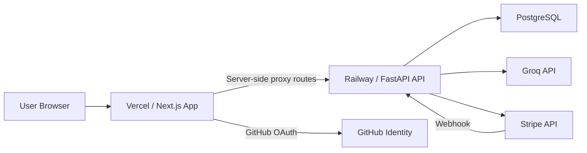

# Architecture Overview

This document explains how the current AI Resume Analyzer codebase is structured across frontend, backend, auth, analysis, billing, and persistence.

## High-Level System

- Frontend: Next.js App Router on Vercel
- Backend: FastAPI on Railway
- Database: PostgreSQL
- AI provider: Groq
- Auth: GitHub OAuth through NextAuth/Auth.js
- Billing: Stripe Checkout + Stripe Billing Portal

## Frontend Flow

### Public App Flow

1. The landing page renders the analyzer workspace.
2. A user uploads a PDF and pastes a job description.
3. The frontend posts `FormData` to its local `/api/analyze` route.
4. That local route forwards the request to FastAPI.
5. The result renders inside the premium analysis UI.

### Authenticated App Flow

1. The user signs in with GitHub.
2. NextAuth stores the session server-side.
3. The frontend syncs the user into the backend database.
4. Dashboard pages fetch user-scoped data through server-side helpers.
5. Billing actions go through local Next.js proxy routes before touching FastAPI.

## Backend Flow

### Core Services

- `app/main.py`
  - API routes
  - auth sync
  - analyze endpoint
  - billing endpoints
  - history endpoints
  - metrics endpoint
- `app/services/pdf_parser.py`
  - extracts raw text from uploaded PDFs
- `app/services/ai_service.py`
  - mock mode or Groq analysis
- `app/services/stripe_service.py`
  - Stripe Checkout
  - Stripe Billing Portal
  - webhook signature verification
- `app/security.py`
  - rate limiting
  - proxy-aware IP detection
  - PDF magic-byte validation

### Data Access

- `app/repositories/user_repository.py`
  - user lookup
  - user upsert
  - promote user to pro
- `app/repositories/analysis_repository.py`
  - save analysis
  - list analyses
  - fetch analysis detail
  - fetch user-scoped history

## Auth Flow

1. User clicks GitHub sign-in on the frontend.
2. NextAuth completes GitHub OAuth.
3. During auth callbacks, the frontend calls `POST /api/auth/sync-user`.
4. That backend endpoint upserts the user row.
5. The NextAuth session stores:
   - `id`
   - `plan`
   - `analysisCount`
6. Protected pages call `requireCurrentUser()` server-side.

## Analyze Flow

1. The browser posts `FormData` to `frontend/app/api/analyze/route.ts`.
2. If the user is signed in, the proxy forwards:
   - `X-Internal-API-Secret`
   - `X-User-Id`
3. FastAPI validates:
   - file type
   - PDF magic bytes
   - file size
   - job description size
   - free-plan usage limit
4. The backend extracts PDF text.
5. The backend calls Groq, or mock mode if enabled.
6. On successful analysis payload:
   - the analysis is saved
   - `user.analysis_count` increments when a user is attached
7. The response returns the existing `AnalyzeResponse` schema.

## Stripe Flow

### Checkout

1. The dashboard or limit CTA calls frontend `/api/billing/create-checkout-session`.
2. That proxy checks auth and forwards internal headers to FastAPI.
3. FastAPI creates a Stripe Checkout session.
4. Stripe redirects the user back to `/dashboard`.

### Webhook

1. Stripe sends a webhook to `POST /api/billing/webhook`.
2. FastAPI verifies the Stripe signature.
3. The backend finds the user by:
   - `stripe_customer_id`
   - checkout metadata
   - email fallback
4. The user plan is updated to `pro`.

### Billing Portal

1. A Pro user clicks `Manage Billing`.
2. The frontend calls `/api/billing/create-portal-session`.
3. The Next.js proxy authenticates the request.
4. FastAPI requires a stored `stripe_customer_id`.
5. FastAPI returns a Stripe-hosted portal URL.
6. The browser redirects to Stripe Billing Portal.

## Protected Analysis History Flow

1. The dashboard requests recent analyses through backend user-scoped endpoints.
2. Clicking a saved item opens `/dashboard/analyses/[id]`.
3. The page calls a server-side helper that fetches:
   - `GET /api/account/analyses/{analysis_id}`
4. FastAPI checks the signed-in user identity through internal headers.
5. The backend returns the analysis only if it belongs to that user.
6. Otherwise it returns `404`.

## Database Tables

### `users`

- `id`
- `email`
- `name`
- `image`
- `stripe_customer_id`
- `plan`
- `analysis_count`
- `created_at`

### `analyses`

- `id`
- `user_id`
- `resume_text`
- `job_description`
- `analysis_json`
- `created_at`

## Deployment Diagram

## Request Boundaries

### Browser-facing routes

- `/`
- `/login`
- `/dashboard`
- `/dashboard/analyses/[id]`
- `/api/analyze`
- `/api/billing/create-checkout-session`
- `/api/billing/create-portal-session`

### Backend-facing routes

- `/health`
- `/metrics`
- `/api/auth/sync-user`
- `/api/cv/analyze`
- `/api/cv/download-optimized`
- `/api/analyses`
- `/api/analyses/{analysis_id}`
- `/api/account/analyses`
- `/api/account/analyses/{analysis_id}`
- `/api/billing/create-checkout-session`
- `/api/billing/create-portal-session`
- `/api/billing/webhook`
